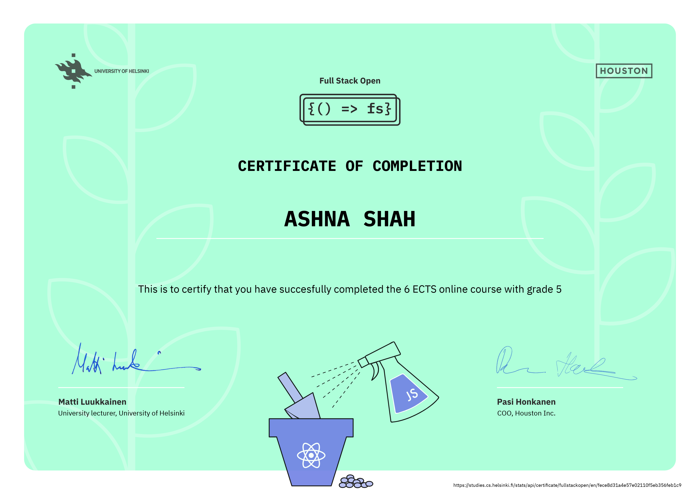

#### Full Stack Open 2020

[Course](https://fullstackopen.com/en)

***

#### Frontend:
* React
* Redux
* Axios

#### Backend:
* NodeJS
* Express

#### Testing:
* Jest
* Cypress.io

***

#### Certificate:
<table>
  <tr>
    <td>
    
    </td>
  </tr>
 </table>

